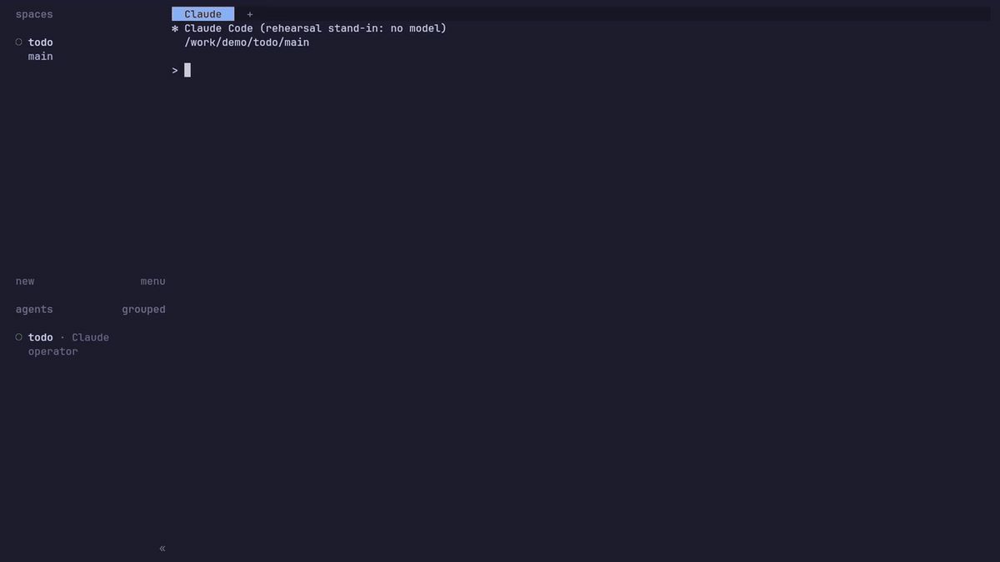

# Paneyard

Paneyard is a local, single-operator queue and supervisor for interactive AI coding-agent sessions ([Claude Code](https://docs.anthropic.com/en/docs/claude-code) and [Codex](https://github.com/openai/codex)). You queue a task against one of your repositories, from its default branch or any other; when a slot frees, [herdr](https://herdr.dev) gives the task its own git worktree and workspace, with one live agent session in it that you can watch and type into. The session does the work and leaves it uncommitted. Nothing is committed, pushed or merged until you ask for that particular step.



*A live take with real Claude Code (Sonnet), sped up where the agents work: recorded in Docker with `demo/bin/record`, see [docs/demo-recording-plan.md](./docs/demo-recording-plan.md).*

It installs as a herdr plugin and is used from inside herdr: keys to queue a task for the repository you are in, read a run's report, or close its session. Underneath it is a Rails 8 app running on your own machine, which the plugin starts and looks after for you. Rails decides *which* task runs, *where*, and what happens to the worktree afterwards; the agent session decides everything else. There is no planner, no step queue and no pull-request automation.

> [!WARNING]
> **Read the [security model](#security-model) before you run this.** It has no authentication, and it hands AI agents unrestricted access to the repositories you register and to your user account.

## Contents

- [Security model](#security-model)
- [Requirements](#requirements)
- [Getting started](#getting-started)
  1. [Install the plugin](#1-install-the-plugin)
  2. [Bind keys](#2-bind-keys)
  3. [Queue a task](#3-queue-a-task)
  4. [Read reports and close sessions](#4-read-reports-and-close-sessions)
  5. [Queue runs from your own agent](#5-queue-runs-from-your-own-agent)
  - [Settings, updates and removal](#settings-updates-and-removal)
  - [Running without the plugin](#running-without-the-plugin)
- [How a run works](#how-a-run-works)
- [Workspace layouts](#workspace-layouts)
- [Configuration](#configuration)
- [Documentation](#documentation)
- [Contributing](#contributing)
- [License](#license)

## Security model

This is a tool for one trusted person on their own machine. Treat anything that can reach it as having a shell on that machine. [SECURITY.md](./SECURITY.md) has the full threat model and how to report a vulnerability.

- **No authentication.** Every web page, every form, and the `/mcp/admin` MCP endpoint are open to whoever can connect. There are no user accounts; the operator is whoever is at the keyboard.
- **Loopback only.** The plugin, `bin/service` and `bin/production` bind to `127.0.0.1` and `bin/dev` to `localhost`, so nothing else on your network can connect. In production the app also answers only loopback `Host` names (`localhost`, `127.0.0.1`, `[::1]`), which stops DNS-rebinding attacks from web pages you visit. `BINDING` and `PANEYARD_ALLOWED_HOSTS` widen this; if you set either, whatever sits in front of the app must provide the authentication it lacks.
- **Agents run with approvals bypassed.** Each session is launched with full access and no confirmation prompts: `claude --permission-mode bypassPermissions`, `codex -s danger-full-access`. It works in its own worktree but is not sandboxed: it can read and write anything your user account can, run any command, and use your network. The only review gate is you, reading its report and trying its changes before asking it to commit.
- **Registered repositories are fully exposed to their sessions**, including any secrets you keep in them. A session's panes are your own login shell, with whatever credentials it has (your SSH agent, your `gh` login).
- **It can edit itself.** If you register this repository as one of its own workspaces, a session can change the orchestrator's code, and the running instance hot-reloads application code (`PANEYARD_HOT_RELOAD`). Nothing stops a session from merging into its base branch when asked to.
- **Telegram remote control** (optional, off unless configured) lets the Telegram user IDs on an allow-list list sessions, read their panes and reports, and type into them from a private chat. That is equivalent to shell access. Pane text and reports also pass through Telegram's servers, and bot chats are not end-to-end encrypted.
- **GitHub credentials.** Paneyard makes no GitHub calls and hands sessions no tokens. A session pushes, when asked to, with whatever your login shell can push with (your SSH key, your `gh` login), so it can do anything you can on those repositories.
- **Plaintext state.** Runs and reports are stored unencrypted in SQLite: in the plugin's state directory (`~/.local/state/herdr/plugins/paneyard/storage`), or under `storage/` for `bin/service`. The plugin's `.env` holds any Telegram token you give it, readable by your user only.
- **The plugin is code herdr runs as you.** herdr does not sandbox plugins. Its startup hook starts Paneyard whenever herdr starts; review `herdr-plugin.toml` and `bin/herdr-plugin` before installing, as herdr's install preview suggests.

## Requirements

- **[herdr](https://herdr.dev) 0.7.0 or newer, running.** herdr owns every terminal pane and agent process, and Paneyard installs into it as a plugin.
- **macOS or Linux**, on Intel or ARM64. Windows is not supported.
- **`curl`, `tar`, and a SHA-256 utility** (`shasum` on macOS, `sha256sum` on Linux). The plugin downloads a verified, platform-specific Ruby and production gem bundle; it does not need a system Ruby, Bundler, compiler, or development headers.
- **git**, with each repository you want to queue tasks for checked out as described in [Preparing a repository](./docs/operating.md#preparing-a-repository).
- **At least one agent CLI, already signed in:** `claude` and/or `codex`, on the `PATH` of your login shell (the shell a herdr pane opens). Sessions start non-interactively and cannot complete a login flow, or Claude Code's folder-trust prompt: open `claude` once in a new repository's `main` checkout and trust it. Unless you choose otherwise, a session uses a sensible default model for its driver (`Orchestrator::DefaultModels`).
- **Optional:** `nvim` (the default pane layout opens it beside the agent), `gh` signed in (for sessions pushing over HTTPS).

## Getting started

### 1. Install the plugin

```sh
herdr plugin install nicholasjstock/paneyard
```

herdr shows what the plugin will run, then downloads the matching bundled Ruby and production gems. No compiler is used on your machine. Paneyard starts on its own the next time herdr starts, or the first time you use any of its actions. Its database, logs and generated secrets live in the plugin's state directory (`~/.local/state/herdr/plugins/paneyard`), and it picks a free local port for itself and keeps it.

### 2. Bind keys

Plugins can't bind keys themselves. Add these to herdr's `config.toml` (or pick your own keys), then `herdr server reload-config`:

```toml
[[keys.command]]
key = "prefix+q"
type = "plugin_action"
command = "paneyard.queue"
description = "paneyard: queue a task here"

[[keys.command]]
key = "prefix+r"
type = "plugin_action"
command = "paneyard.runs"
description = "paneyard: runs and reports"

[[keys.command]]
key = "prefix+x"
type = "plugin_action"
command = "paneyard.close"
description = "paneyard: close this run's session"
```

Every action is also available without a key: `herdr plugin action list --plugin paneyard`, and `herdr plugin action invoke paneyard.<id> --plugin paneyard`.

| Action | What it does |
| --- | --- |
| `paneyard.queue` | In a pane inside a repository: queue a task for it. The first time, it registers the repository as a workspace (and tells you what to fix if its layout is wrong). |
| `paneyard.runs` | Every run, newest first. Pick one to read its newest report, jump to its herdr workspace, close its session, or open it in the browser. |
| `paneyard.report` | Inside a run's herdr workspace: that run's newest report. |
| `paneyard.close` | Inside a run's herdr workspace: close its session (asks first). |
| `paneyard.open` | Open the web UI, at the run's page when invoked in a run's workspace. |
| `paneyard.setup` | Detect Claude Code and Codex, then offer to connect them to Paneyard. |
| `paneyard.mcp` | Alias for `paneyard.setup` (kept for existing key bindings). |
| `paneyard.mcp-url` | Show the `/mcp/admin` URL as a notification. |
| `paneyard.restart`, `paneyard.stop` | Apply a settings change; stop Paneyard (any action starts it again). Running sessions are not affected by either. |

### 3. Queue a task

Any git checkout you already have will do, with any branch checked out, as long as it has an `origin` remote. Open a herdr pane anywhere in it and press your **queue** key. The first time, Paneyard registers the repository as a **workspace** (named after its directory, with the repository's default branch as the branch runs start from). Describe the task (a blank line submits), choose the **base branch** to start from (Enter for the default; it offers the branch your pane is on), pick a driver (`claude` or `codex`; Enter for `claude`), and it is queued. When a slot frees, herdr creates the run's worktree from that branch, wherever your herdr config puts worktrees, and opens it as a herdr workspace with the agent in it. Your own checkout is never touched. [Preparing a repository](./docs/operating.md#preparing-a-repository) has every rule the launch checks, and how to tell a session to set up and test your repository.

### 4. Read reports and close sessions

When the agent stops, it posts a report. Read it with the **runs** key (or **report** inside the run's workspace). Type into the agent's pane to give it more work, and ask it to commit, push or merge when you are happy; it merges back into the branch it started from. When you are done with it, the **close** key ends the session and frees its slot. The web UI (`paneyard.open`) has the same, plus workspace settings and the [layout editor](#workspace-layouts).

### 5. Queue runs from your own agent

Paneyard's `/mcp/admin` endpoint lets an MCP client queue and inspect runs. At the end of installation, Herdr prints the command for the interactive `paneyard.setup` action. It detects installed Claude Code and Codex CLIs, asks before changing either one, and registers the endpoint at user scope. Running it again recognizes an up-to-date entry and does not duplicate it. By hand:

```sh
claude mcp add --transport http -s user paneyard "$(cat ~/.local/state/herdr/plugins/paneyard/url)/mcp/admin"
codex mcp add paneyard --url "$(cat ~/.local/state/herdr/plugins/paneyard/url)/mcp/admin"
```

The port stays the same across restarts; if it ever has to change (something else took it), Paneyard shows a notification, and `paneyard.setup` updates the registrations in one action. Then ask your agent to queue a task, list runs, or check on one. The endpoint is unauthenticated, like the rest of the app, so it only listens on loopback. [MCP endpoints](./docs/operating.md#mcp-endpoints) lists its tools.

### Settings, updates and removal

- **Settings** live in `$(herdr plugin config-dir paneyard)/.env`, written on first start with every option commented out: concurrency, default models, [Telegram](./docs/telegram.md), a fixed port, and which Ruby to use. Run `paneyard.restart` after editing it (the next action notices the edit and restarts too).
- **Updating:** `herdr plugin install nicholasjstock/paneyard` again (`--ref <tag-or-commit>` to pin a version). The next action or herdr start restarts Paneyard on the new code and migrates its database; state and settings are kept.
- **Removing:** `herdr plugin action invoke paneyard.stop --plugin paneyard`, then `herdr plugin uninstall paneyard`. herdr leaves the state and config directories in place; delete them to remove your run history too.
- **Logs:** `~/.local/state/herdr/plugins/paneyard/log/paneyard.log`, and `herdr plugin log list --plugin paneyard` for the actions themselves.

### Running without the plugin

Paneyard is an ordinary Rails app, and the plugin only packages it. To run it from a clone instead (as its contributors do):

```sh
git clone https://github.com/nicholasjstock/paneyard.git && cd paneyard
bin/setup                    # install gems
bin/rails credentials:edit   # once: creates a key and a secret_key_base (or export SECRET_KEY_BASE)
bin/service start            # also: stop | restart | status; http://127.0.0.1:7263
```

`bin/service` keeps its state in the clone's `storage/` and logs to `log/production_service.log`; [Long-running: `bin/service`](./docs/operating.md#long-running-binservice) has the details, and [CONTRIBUTING.md](./CONTRIBUTING.md) covers `bin/dev` and the sandbox.

To move from `bin/service` to the plugin with your history, stop `bin/service`, run `paneyard.stop`, copy `storage/production*.sqlite3` from the clone into `~/.local/state/herdr/plugins/paneyard/storage/`, and invoke any action. Copy any `TELEGRAM_*` settings from your credentials into the plugin's `.env`. (Two instances side by side are safe for your worktrees, since each only ever cleans up its own runs', but they share no queue and no concurrency cap.)

## How a run works

1. **Queue.** A run waits for a slot. The cap is global across all workspaces: `PANEYARD_MAX_CONCURRENT_RUNS`, default 4.
2. **Dispatch.** When a slot frees, herdr creates the oldest queued run's worktree on a `paneyard/<name>` branch, from the current local tip of the run's **base branch** (the workspace's default unless the run named another), and opens it as a herdr workspace, where one interactive agent session starts with the task as its first prompt. Several runs of one repository can start from different branches at once.
3. **Work.** The session explores, edits and runs the repository's own commands, then leaves its changes uncommitted. Commit, push and merge are separate requests; it does only the one you ask for, and a merge goes back into the run's own base branch.
4. **Report.** Each time it stops, the session calls the `report_idle` MCP tool (`done`, `blocked` or `failed`) with a Markdown report. The session stays open and keeps its slot; reports accumulate as checkpoints on the run screen.
5. **Close.** **Close session** quits the agent, closes its herdr workspace and frees the slot. A run you haven't closed keeps holding its slot.
6. **Clean up.** herdr removes the worktree once its work is saved (clean, and in the run's base branch or pushed). Otherwise it is kept and flagged until you push, merge, or choose **Remove worktree**. Only Paneyard's own run worktrees are ever removed, never yours.

If a session dies without reporting, the orchestrator notices within about 30 seconds and frees the slot. Pull requests are yours to open from a pushed branch; the orchestrator never opens, watches or merges them.

## Workspace layouts

Each run opens in its own herdr workspace. A workspace's **layout** decides which tabs and panes that herdr workspace has: the agent, plus anything you want running beside it, such as an editor, a dev server or a log tail. By default a run gets the agent with `nvim .` split to its right, or just the agent when `nvim` isn't installed.

To change it, edit the workspace (or set it when you add one) and use its **Layout** editor. Name each tab, add panes, give each a command, and choose which earlier pane it splits off, to the right or below, and how much space that pane keeps. A live sketch shows the result, and **Reset to default** goes back to the default. The layout is saved as YAML:

```yaml
tabs:
  - name: main
    panes:
      - agent                       # required: the first pane of the first tab
      - name: editor
        command: nvim .
        split: { of: agent, direction: right, ratio: 0.5 }
  - name: logs
    panes:
      - name: dev-log
        command: tail -f log/development.log
```

Every pane opens in the run's worktree as your normal login shell; Paneyard sets no environment in any of them. A pane with no command is a plain shell. Panes are set up once, when the session starts: Paneyard never watches or restarts them, and **Close session** closes them all. [Workspace layouts](./docs/operating.md#workspace-layouts) in operating.md has the full rules.

## Configuration

Everything is optional except herdr and an agent CLI. With the plugin, put these in `$(herdr plugin config-dir paneyard)/.env`; the plugin sets `PORT` (unless you pin one there), `BINDING`, `PANEYARD_RAILS_URL` and `HERDR_SOCKET_PATH` itself. Running from a clone, they are environment variables.

| Setting | Default | Purpose |
| --- | --- | --- |
| `PORT` | chosen once and kept (plugin), random (`bin/dev`), `7263` (`bin/service`) | HTTP port. |
| `BINDING` | `localhost` (dev), `127.0.0.1` (`bin/service`) | Interface Rails listens on. Widening it exposes an unauthenticated app; see [SECURITY.md](./SECURITY.md). |
| `PANEYARD_ALLOWED_HOSTS` | unset | Extra `Host` names production answers to (comma-separated), for example behind a reverse proxy. |
| `PANEYARD_RAILS_URL` | `http://127.0.0.1:$PORT` | URL sessions use to reach the orchestrator's MCP endpoint. Keep it in step with `PORT`. |
| `PANEYARD_MAX_CONCURRENT_RUNS` | `4` | Global cap on live sessions. |
| `PANEYARD_CLAUDE_MODEL`, `PANEYARD_CODEX_MODEL` | per driver | Default model per driver; a model picked per run wins. |
| `HERDR_SOCKET_PATH` | the socket herdr gives the plugin, else `~/.config/herdr/herdr.sock` | herdr's socket. |
| `PANEYARD_RUBY` | bundled runtime | Development links only: fallback Ruby when `[[build]]` has not installed the bundle. |
| `TELEGRAM_BOT_TOKEN`, `TELEGRAM_ALLOWED_USER_IDS` | unset | Telegram remote control; see [docs/telegram.md](./docs/telegram.md). Also settable in credentials when running from a clone. |

Pane layouts are set per workspace ([above](#workspace-layouts)). So are environment variables, which sessions record for later runs; see [What a run starts with](./docs/operating.md#3-what-a-run-starts-with-inside-the-repo).

## Documentation

- [docs/herdr-plugin-plan.md](./docs/herdr-plugin-plan.md) — how the herdr plugin is put together, and why.
- [docs/operating.md](./docs/operating.md) — running the orchestrator day to day: preparing repositories, base branches, git and cleanup rules, workspace layouts, MCP endpoints, troubleshooting a failed launch.
- [docs/telegram.md](./docs/telegram.md) — Telegram remote control, and adding another chat platform.
- [docs/README.md](./docs/README.md) — index of the design records behind the current architecture.
- [AGENTS.md](./AGENTS.md) — the architecture and conventions guide for anyone (human or agent) changing this codebase.
- [CHANGELOG.md](./CHANGELOG.md) — what has changed.

## Contributing

See [CONTRIBUTING.md](./CONTRIBUTING.md) for setting up to develop Paneyard, running it with `bin/dev` or in the sandbox, the tests and CI, the code layout, and the design rules a change has to follow; [AGENTS.md](./AGENTS.md) is the detailed architecture guide behind it. In short: `bin/setup`, make your change, and run `bin/verify` (specs, RuboCop, a production boot smoke test, an end-to-end run through the sandbox, and security audits) before opening a pull request.

## License

Released under the [MIT License](./LICENSE). Copyright (c) 2026 Nicholas Stock.
